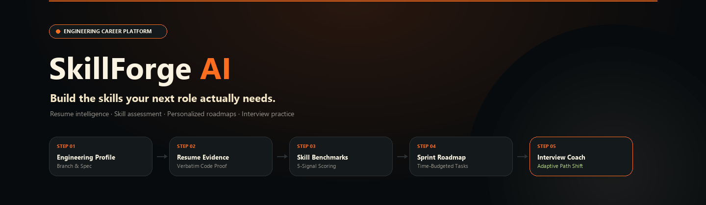
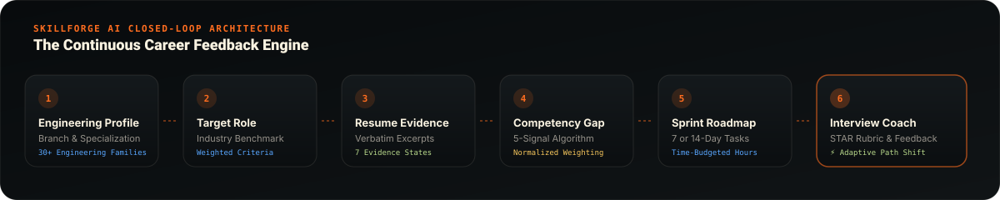
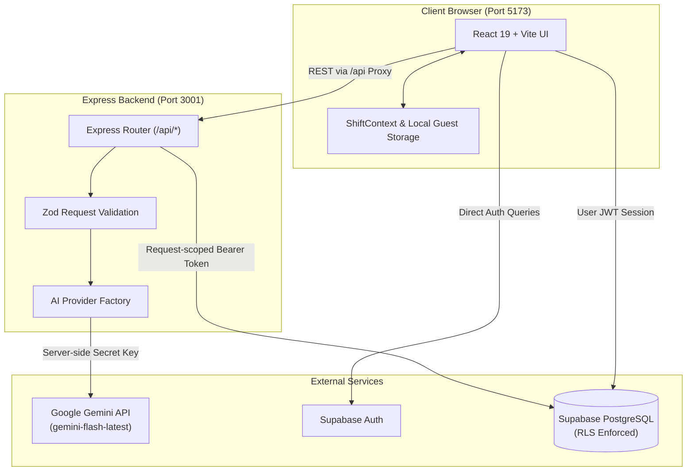

<div align="center">

  <picture>
    <source media="(prefers-color-scheme: dark)" srcset="docs/assets/readme-banner.svg">
    <source media="(prefers-color-scheme: light)" srcset="docs/assets/readme-banner.svg">
    
  </picture>

  <br />
  <br />

  <p align="center">
    <strong>Build the skills your next role actually needs.</strong><br />
    SkillForge AI connects your engineering background, resume evidence, target-role benchmarks, and available study hours into an explainable, verifiable career readiness path.
  </p>

  <p align="center">
    <a href="https://react.dev/"></a>
    <a href="https://www.typescriptlang.org/"></a>
    <a href="https://vite.dev/"></a>
    <a href="https://supabase.com/"></a>
    <a href="https://ai.google.dev/"></a>
    <a href="https://tailwindcss.com/"></a>
    <a href="LICENSE"></a>
  </p>

  <p align="center">
    <a href="#why-skillforge-ai">Why SkillForge AI</a> •
    <a href="#what-you-can-do">Features</a> •
    <a href="#how-it-works">Workflow</a> •
    <a href="#how-skill-recommendations-work">Competency Engine</a> •
    <a href="#engineering-coverage">Engineering Branches</a> •
    <a href="#quick-start">Quick Start</a> •
    <a href="#architecture">Architecture</a>
  </p>

</div>

---

## Why SkillForge AI?

Engineering students often excel in academic coursework but struggle to answer three critical career questions:
1. *Which exact technical competencies does my target industry role actually demand?*
2. *What does my resume factually substantiate versus merely claim in a keyword list?*
3. *Given my remaining semester time and weekly hours, what should I build next?*

Generic career advisors offer high-level advice, while typical AI resume scanners perform naive keyword searches that reward buzzword stuffing. **SkillForge AI** solves this disconnect by combining **verbatim resume evidence extraction**, **explainable multi-signal skill benchmarking**, **time-budgeted sprint roadmaps**, and **adaptive technical interview practice** into a single closed-loop workspace.

---

## What You Can Do

| Capability | What It Helps You Do |
| :--- | :--- |
| **Engineering Profile** | Select from **31 engineering branches**, streams, and technical specializations with persistent user profiles. |
| **Target-Role Explorer** | Benchmark your skills against **20 curated engineering roles** spanning Software, AI/Data, Embedded, Mechanical, and Civil disciplines. |
| **Verbatim Evidence Audit** | Extracts verifiable project excerpts from your resume; flags unevidenced claims as *"Claimed only"* without hallucinating abilities. |
| **Multi-Signal Skill Scoring** | Computes transparent readiness scores using 5 weighted signals (Resume, Diagnostics, Interview, Self-Rating, and Task completions). |
| **Diagnostic Checks** | Complete optional 5–10 question scenario-based technical assessments to objectively validate conceptual fundamentals. |
| **Time-Budgeted Sprint Roadmap** | Generates realistic 7 or 14-day study plans calculated against your weekly available study hours ($Weekly\ Hours \times \frac{Days}{7}$). |
| **AI Technical Interview Coach** | Practice realistic scenario and architecture questions scored against a 5-dimension STAR rubric (Relevance, Structure, Specificity, Evidence, Clarity). |
| **Adaptive Next Steps** | If an interview answer reveals a degraded concept, the engine automatically promotes that topic to Day 1 top priority. |
| **Hybrid Persistence & Offline Mode** | Full cloud synchronization with Supabase (Auth + PostgreSQL + Row-Level Security) paired with instant offline guest exploration. |

---

## How It Works

SkillForge AI connects every stage of career preparation into a continuous feedback loop:

<div align="center">
  <picture>
    <source media="(prefers-color-scheme: dark)" srcset="docs/assets/career-journey.gif">
    <source media="(prefers-color-scheme: light)" srcset="docs/assets/career-journey.gif">
    
  </picture>
</div>

1. **Define Your Focus:** Choose your engineering branch, stream, target role, and weekly time budget (e.g., Computer Science $\to$ Web Systems $\to$ Frontend Developer $\to$ 8 hrs/week).
2. **Audit Evidence:** Upload or paste your resume. The engine parses verifiable project accomplishments, extracts quantitative metrics, and identifies compliance standards (IEEE, ISO, WCAG, etc.).
3. **Benchmark Gaps:** Transparent algorithms classify every required competency into *Demonstrated*, *Partial*, or *Missing* states.
4. **Execute Sprint Tasks:** Follow actionable daily milestones equipped with estimated completion times, prerequisites, and vetted documentation links.
5. **Interview & Adapt:** Answer technical scenario probes. If the evaluation detects a weakness, the learning path adapts immediately to reinforce that exact skill.

---

## How Skill Recommendations Work

SkillForge AI rejects "black-box" scoring. The competency engine operates under clear, inspectable rules designed for student trust:

### 1. Transparent 5-Signal Weighting

When evaluating an engineering competency, the system synthesizes up to five distinct signals:

$$\text{Current Skill Level} = \sum (\text{Signal Score} \times \text{Weight})$$

```text
Resume Project Evidence      : 35%  (Verified verbatim implementations)
Diagnostic Assessment Score  : 30%  (Objective multiple-choice conceptual checks)
Interview Answer Performance : 20%  (Live answer evaluation across STAR dimensions)
Candidate Self-Assessment    : 10%  (Subjective 1-to-5 confidence level)
Roadmap Task Completion      :  5%  (Hands-on task verification)
```

> **Dynamic Normalization:** If a signal is not yet available (for example, before taking a diagnostic check), the engine **normalizes the remaining weights to 100%** rather than penalizing the student with a zero.

### 2. The 7 Verifiable Evidence States

A skill is never labelled "demonstrated" based on a single bullet in a skills list:

| Evidence State | Meaning | Weight |
| :--- | :--- | :---: |
| `not_observed` | Competency not mentioned anywhere on resume. | $0.0$ |
| `claimed` | Listed in a skills summary without supporting context or projects. | $1.0$ |
| `coursework_only` | Studied in academic courses or lecture syllabus. | $1.8$ |
| `partial_evidence` | Basic usage mentioned, but lacks architecture depth or metrics. | $2.5$ |
| `project_demonstrated` | Verifiable code implementation found in an academic or personal project. | $3.5$ |
| `industry_evidence` | Verified in commercial internship, lab fellowship, or client delivery. | $4.2$ |
| `validated_by_assessment`| Corroborated through diagnostic checks and technical interview responses. | $5.0$ |

### 3. Confidence vs. Proficiency

- **Proficiency (0.0 – 5.0):** Estimated current ability based on available evidence.
- **Confidence Rating:** Separately tracks reliability (`High confidence`, `Medium confidence`, `Needs validation`). Contradictory signals (e.g., self-rating of 5/5 but failing diagnostic questions) apply a calibrated confidence penalty.

---

## Engineering Coverage

SkillForge AI incorporates **31 structured engineering branches** organized across 6 major families:

<details open>
<summary><strong>1. Software, Computing, AI & Data</strong></summary>

- Computer Science and Engineering
- Information Technology
- Software Engineering
- Artificial Intelligence and Machine Learning
- Data Science and Analytics
</details>

<details open>
<summary><strong>2. Electronics, Electrical & Embedded Systems</strong></summary>

- Electronics and Communication Engineering (ECE)
- Electrical and Electronics Engineering (EEE)
- Electrical Engineering
- Embedded Systems Engineering
- Instrumentation and Control Engineering
</details>

<details open>
<summary><strong>3. Mechanical, Manufacturing & Robotics</strong></summary>

- Mechanical Engineering
- Mechatronics Engineering
- Robotics and Automation
- Automobile Engineering
- Aerospace Engineering
- Manufacturing Engineering
- Industrial & Production Engineering
</details>

<details>
<summary><strong>4. Civil, Structural & Environmental</strong></summary>

- Civil Engineering
- Structural Engineering
- Environmental Engineering
- Transportation & Infrastructure Planning
</details>

<details>
<summary><strong>5. Chemical, Biological, Medical & Materials</strong></summary>

- Chemical Engineering
- Biotechnology
- Biomedical Engineering
- Materials and Metallurgical Engineering
- Petroleum & Mining Engineering
</details>

<details>
<summary><strong>6. Applied & Interdisciplinary Sciences</strong></summary>

- Engineering Physics
- Renewable Energy Engineering
- Agricultural Engineering
</details>

---

## Quick Start

### Prerequisites
- **Node.js:** v18.0.0 or later (v20+ recommended)
- **Package Manager:** npm (bundled with Node.js)

### 1. Clone the Repository
```bash
git clone https://github.com/meoxx009/PATHFINDERs.git
cd PATHFINDERs/shift-app
```

### 2. Install Dependencies
```bash
npm install
```

### 3. Configure Environment Variables
Copy the template and supply your credentials:
```bash
cp .env.example .env.local
```

*(See [Environment Configuration](#environment-configuration) below for details.)*

### 4. Run the Application

The project consists of a **Vite React frontend** and an **Express API backend**. Run them in separate terminal tabs:

**Terminal 1 — Express Backend API (Port 3001):**
```bash
npm run server
```

**Terminal 2 — Vite Frontend (Port 5173):**
```bash
npm run dev
```

Open your browser at **`http://localhost:5173`**. The Vite development server automatically proxies `/api/*` network requests to `http://localhost:3001`.

---

## Environment Configuration

SkillForge AI maintains strict isolation between browser-safe public keys and server-only secrets:

| Variable | Purpose | Environment Scope | Required For |
| :--- | :--- | :--- | :--- |
| `VITE_SUPABASE_URL` | Public Supabase project URL | Browser & Server | Cloud authentication & persistence |
| `VITE_SUPABASE_ANON_KEY` | Public publishable anon key (safe for browser) | Browser & Server | Client-side Supabase queries |
| `SUPABASE_SERVICE_ROLE_KEY` | Administrative service-role key | Server ONLY | Server-side admin operations |
| `PORT` | Express backend listening port (`3001`) | Server | Backend server startup |
| `VITE_API_BASE_URL` | API proxy endpoint (`/api`) | Browser | Frontend routing to backend |
| `AI_PROVIDER` | Active AI provider (`google_gemini` or `demo`) | Server | AI generation engine |
| `AI_MODEL` | Exact Gemini model ID (`gemini-flash-latest`) | Server | Google AI Studio model routing |
| `GOOGLE_API_KEY` | Google AI Studio secret API key | Server ONLY | Live Gemini API completions |
| `DEMO_MODE` | Set `false` for live AI; `true` for deterministic demo | Server | Toggle live AI vs offline demo |

> **Security Note:** Never prefix `GOOGLE_API_KEY` or `SUPABASE_SERVICE_ROLE_KEY` with `VITE_`. Server secrets are read exclusively in Node.js and are never bundled into client-side code.

---

## Supabase Setup

SkillForge AI works completely offline in guest mode, but connecting Supabase enables persistent multi-device accounts.

1. **Create Project:** Set up a free project on [supabase.com](https://supabase.com).
2. **Apply Database Migrations:** Run the provided SQL migration files in order inside your Supabase **SQL Editor**:
   - [`supabase/migrations/001_initial_schema.sql`](supabase/migrations/001_initial_schema.sql) — Core tables (`profiles`, `resumes`, `analyses`, `learning_paths`, `interview_sessions`) with Row-Level Security (RLS).
   - [`supabase/migrations/002_add_profile_extended_fields.sql`](supabase/migrations/002_add_profile_extended_fields.sql) — Engineering branch, specialization, and career preference schemas.
3. **Configure Auth Redirects:** Under **Authentication $\to$ URL Configuration**, ensure Site URL includes `http://localhost:5173`.
4. **Add Credentials:** Paste your `VITE_SUPABASE_URL` and `VITE_SUPABASE_ANON_KEY` into `.env.local`.

---

## Architecture



---

## Development Checks

All code quality tools and unit tests are configured and verified:

```bash
# Execute unit test suite (23 vitest specs passing)
npm test

# Run TypeScript compiler checks
npm run typecheck

# Run fast code linter (oxlint)
npm run lint

# Compile production bundle
npm run build
```

---

## Planned Improvements

- [ ] Automated PDF resume parser with multi-column layout extraction.
- [ ] Exportable sprint roadmap calendar sync (.ics format).
- [ ] GitHub repository analysis module inspecting real commit history and code quality.
- [ ] Audio-driven interview response recording via Web Audio API.

---

## License

This project is licensed under the **MIT License** — see the [LICENSE](LICENSE) file for details.

```text
Copyright (c) 2026 meoxx009
```
